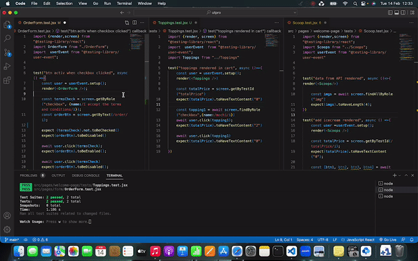

### Icecream app for unit testing exercise

#### Jest and React Test library were used for unit testing
    - Test Driven Development (TDD)
    - red-green testing
    - scopps, topping and order form pages were tested 
        - tests are mostly for user interectians for inputs and buttons
        - user event library was prefered to fireEvent opportunity
        - mouse events like click/dbclich, hover
        - convenient APIs (async, await)
        - regex (/RegEx/i) examples
        - state management as cart adding deleting actions were tested

    

